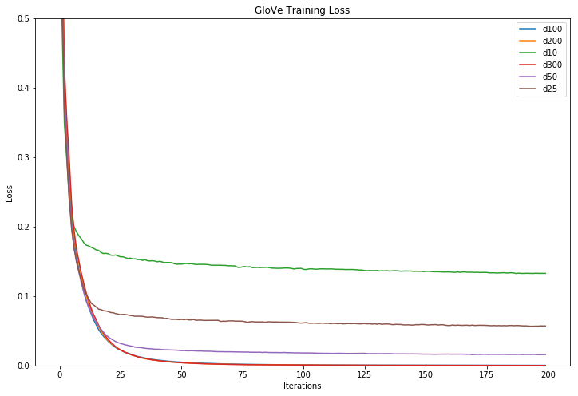

# MIDI GloVe

Create [GloVe](https://nlp.stanford.edu/projects/glove/) embeddings from monophonic MIDI tracks. You can make your own embeddings or use our [pre-trained embeddings](data/embeddings) created from 263,438 monophonic MIDI tracks from the [Lakh MIDI Dataset](http://colinraffel.com/projects/lmd/). You can download the files we used to create our pre-trained embeddings [here](https://github.com/brangerbriz/t-SNEPointSelector/releases/download/data/lmd_mono_tracks_seperated.tar.gz) (139MB).

## Pre-trained Embeddings

Pre-trained embeddings are included for all monophonic tracks (including monophonic tracks pulled from polyphonic MIDI files) from the Lakh MIDI Dataset (LMD). We've included both csv and binary representations of these embedding in the following dimensions:

- 10-D ([bin](data/pre-trained-embeddings/vectors_d10.bin) | [csv](data/pre-trained-embeddings/vectors_d10.txt))
- 25-D ([bin](data/pre-trained-embeddings/vectors_d25.bin) | [csv](data/pre-trained-embeddings/vectors_d25.txt))
- 50-D ([bin](data/pre-trained-embeddings/vectors_d50.bin) | [csv](data/pre-trained-embeddings/vectors_d50.txt))
- 100-D ([bin](data/pre-trained-embeddings/vectors_d100.bin) | [csv](data/pre-trained-embeddings/vectors_d100.txt))
- 200-D ([bin](data/pre-trained-embeddings/vectors_d200.bin) | [csv](data/pre-trained-embeddings/vectors_d200.txt))
- 300-D ([bin](data/pre-trained-embeddings/vectors_d300.bin) | [csv](data/pre-trained-embeddings/vectors_d300.txt))

You can find our pre-trained embeddings in [`data/pre-trained-embeddings`](data/pre-trained-embeddings). Below you will find the training loss for our pre-trained embeddings of each dimension.



Embeddings were created from a 159MB file that contained all note sequences from the monophonic instrument tracks in LMD seperated by an additional `START_TRACK` token. Note values were expressed as general MIDI note values `0-127` and no attempt to represent timing/rythm information was made. See [`notebooks/process_midi_for_glove.ipynb`](notebooks/process_midi_for_glove.ipynb) to see how MIDI data was prepaired before being processed by GloVe.

## Creating Your Own Embeddings

### Setup

```bash
# clone this repo
git clone https://github.com/brangerbriz/midi-glove.git
cd midi-glove

# initialize and clone the GloVe repo
git submodule init
git submodule update

# build GloVe
cd GloVe
make

# return to midi-glove project root
cd ../
pip install -r requirements.txt
```

### Pre-process MIDI

Place a folder of MIDI files you would like to use create the embeddings inside of `data/`. Next start an Jupyter notebook server.

```
jupyter notebook
``` 

Open `notebooks/process_midi_for_glove.ipynb` and change the value of the `midi_dir` variable to point to the folder containing your MIDI files. Run the notebook. Processing can take a while (263,438 took ~36 min on my 4GHz CPU). When processing completes it will output a file to `data/notes.txt`. This will be used as the input to GloVe.

Alternatively you can also copy the contents of the Jupyter notebook to a python script and run it without Jupyter if you prefer.

### Create Embeddings

To create the GloVe embeddings, run:

```bash
./create_embeddings.sh
```

This script will save the embeddings to `data/embeddings` by default, using these settings:

```bash
WORD_FILE=data/notes.txt
OUT_DIR=data/embeddings
MIN_COUNT=5
WINDOW_SIZE=15
DIMENSIONS=( 10 25 50 100 200 300 )
ITERATIONS=200
```

Edit `create_embeddings.sh` to change the default settings.

#### Plotting Loss

To plot the training loss of the GloVe algorithm, save the output of `create_embeddings.sh`.

```bash
./create_embeddings.sh &> data/embeddings/train.out
```

Use [`notebooks/plot_glove_training_loss.ipynb`](notebooks/plot_glove_training_loss.ipynb) to load, parse, and graph the loss from this saved file.

## Citations

#### [Lakh MIDI Dataset](http://colinraffel.com/projects/lmd/)

Colin Raffel. "[Learning-Based Methods for Comparing Sequences, with Applications to Audio-to-MIDI Alignment and Matching](http://colinraffel.com/publications/thesis.pdf)". PhD Thesis, 2016.

#### [GloVe: Global Vectors for Word Representation](https://nlp.stanford.edu/projects/glove/)

Jeffrey Pennington, Richard Socher, and Christopher D. Manning. 2014. GloVe: Global Vectors for Word Representation. 

